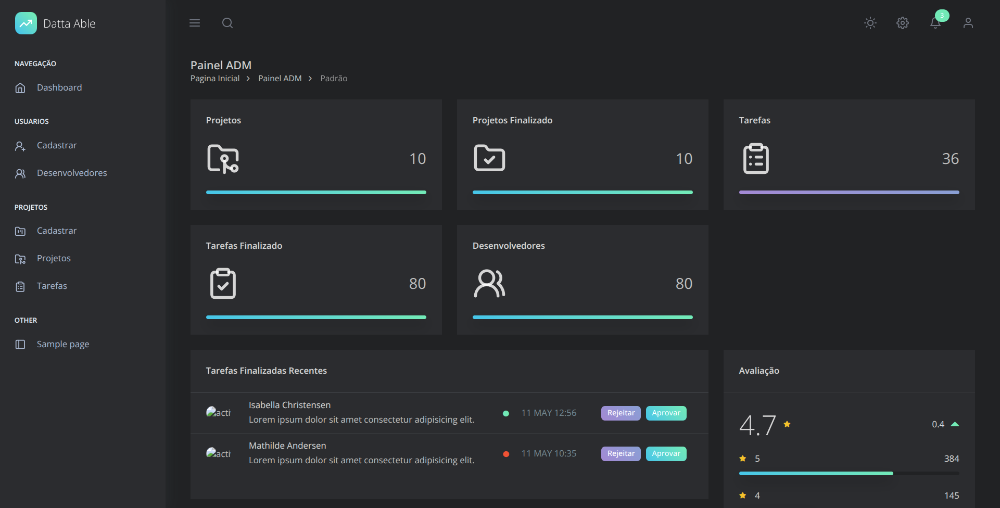

# Gestão de Projetos

[Demostração](https://drive.google.com/file/d/182rgFSLov1utePUArK5JXeMfp6_xAHhW/view?usp=drive_link)

Sistema completo para **gerenciamento de projetos, tarefas e usuários**, desenvolvido com Laravel, Vue.js e Inertia.js. Oferece uma interface moderna e reativa para facilitar o acompanhamento e a organização de equipes e atividades.

---

## Funcionalidades

- **Autenticação de usuários** (registro, login)
- **Gerenciamento de Projetos** (criar, editar, visualizar, excluir)
- **Gerenciamento de Tarefas** (criar, atribuir, definir prazos, status)
- **Atribuição de usuários a projetos e tarefas**
- **Filtros e buscas avançadas**
- **Painel administrativo** com visão geral sistema
- **Perfis de usuário** (administrador, membro)
- **Notificações** (no sistema)

---

## Tecnologias Utilizadas

- **Backend:** [Laravel 12](https://laravel.com/) (PHP 8.2+)
- **Frontend:** [Vue.js 3](https://vuejs.org/) + [Inertia.js](https://inertiajs.com/)
- **Banco de Dados:** MySQL 
- **Estilização:** Tailwind CSS - Daisyui

---

## Pré-requisitos

Antes de começar, você precisará ter instalado em sua máquina:

- [PHP](https://www.php.net/) >= 8.2
- [Composer](https://getcomposer.org/)
- [Node.js](https://nodejs.org/) >= 18.x
- [NPM](https://www.npmjs.com/) ou [Yarn](https://yarnpkg.com/)
- [MySQL](https://www.mysql.com/) 

---
